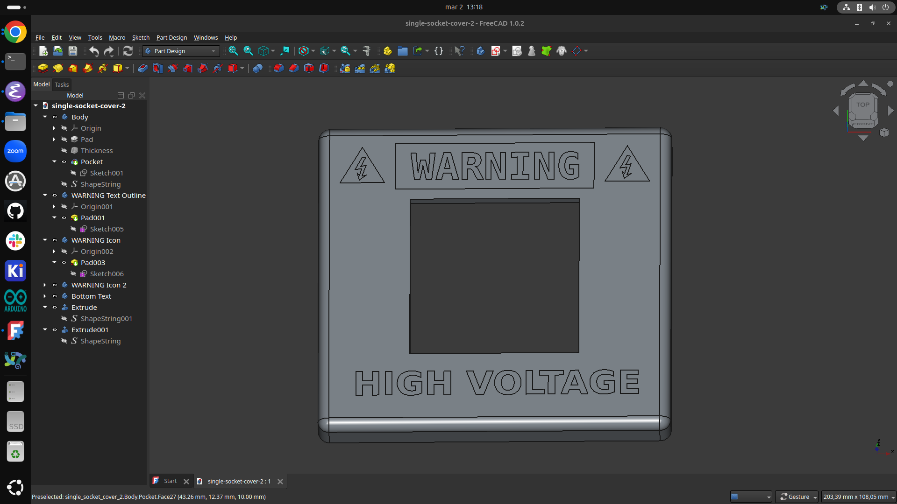
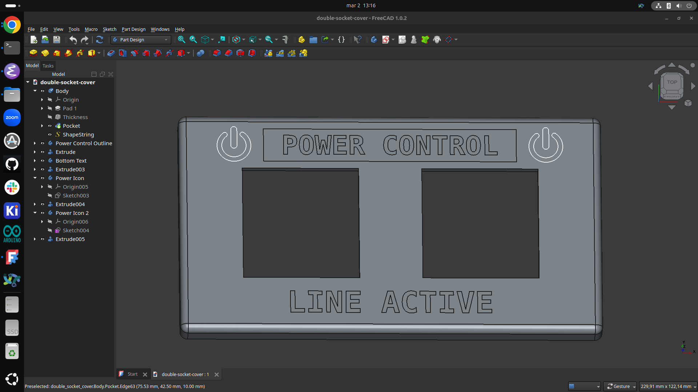

# Light Switch Covers

**Full Design Process**: [Blueprint Project](https://blueprint.hackclub.com/projects/10420)

A set of custom 3D-printed light switch covers with bold industrial designs. The project includes three themed covers (CAUTION, WARNING, and POWER CONTROL), precisely measured to fit the switches in my bedroom. Each cover features a clean, minimalist CAD design with carefully positioned text and icons that are fully surfaced into the plate. Easy to print and install, these covers are designed to give your bedroom a striking, personalized design element.
## CAD Screenshots

| CAUTION Cover | WARNING Cover |
|---------------|---------------|
|  |  |

| POWER CONTROL Cover |
|---------------------|
|  |

## Usage

Print the cover that matches your switch size, type, and preferred design. Place the 3D-printed cover directly on top of your existing light switch plate, or remove the original plate and mount it directly onto the wall. You can secure it using double-sided tape, or for a stronger attachment, use a small amount of superglue. Once installed, the cover adds a bold, personalized touch to your room.

## Why I Built This

I created this project because standard light switch covers are often plain and don’t add much character to a room. I wanted a simple 3D-printed solution that adds a bold, industrial look while keeping a clean, flush design.

## Light Switch

**Coming Soon**

## License

MIT License

---

> GitHub [@adrirubio](https://github.com/adrirubio) &nbsp;&middot;&nbsp;
